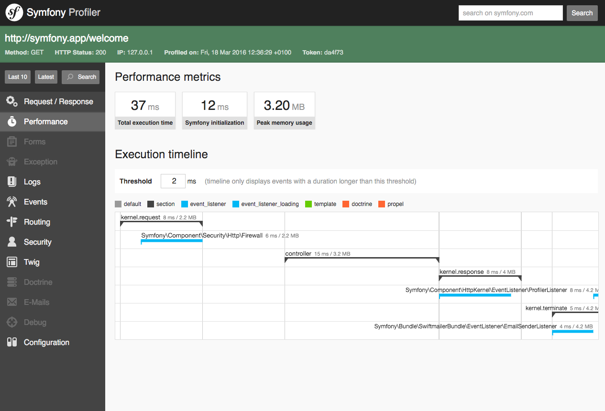

# Débuter avec Symfony
# Un framework PHP & une philosophie

Sur la page de garde du projet Symfony, on peut lire: 
« Symfony est un ensemble de composants PHP, un framework d'application Web, une philosophie et une communauté - tous travaillant ensemble en harmonie. »
Essayons d'en apprendre un peu plus en nous rendant sur leur présentation: 

Pour mieux comprendre ce qu'est un framework, quittons un instant le monde de l'informatique et imaginons une aventure d'alpinisme. Développer une application est très similaire à l'escalade d'une paroi rocheuse: vous êtes en bas (vous avez une application à créer) et vous devez atteindre le sommet (et être satisfait de la réalisation de concevoir une application qui fonctionne parfaitement.)

Si personne n'a jamais escaladé le mur en question, vous devrez vous débrouiller tout seul: tester des itinéraires, revenir en arrière de temps en temps pour ne pas rester coincé dans un virage, rouler dans des pitons, etc. En revanche, si le mur a déjà été conquise, ceux qui vous ont précédés auront déjà fait ce travail d'essais et d'erreurs, ouvrant des chemins possibles (le cadre) et installant les outils qui faciliteront la montée (votre travail).

**Fondamentalement, un framework se compose de:**

- **Une boîte à outils** , un ensemble de composants logiciels préfabriqués et rapidement intégrables. Cela signifie que vous devrez écrire moins de code, avec moins de risque d'erreur. Cela signifie également une plus grande productivité et la possibilité de consacrer plus de temps à ce qui apporte une plus grande valeur ajoutée, comme la gestion des principes directeurs, des effets secondaires, etc.
- **Une méthodologie**  , un «schéma d'assemblage» pour les applications. Une approche structurée peut sembler contraignante au premier abord. Mais en réalité, cela permet aux développeurs de travailler à la fois efficacement et efficacement sur les aspects les plus complexes d'une tâche, et l'utilisation des meilleures pratiques garantit la stabilité, la maintenabilité et l'évolutivité des applications que vous développez.

Et bien que cela puisse paraître évident, nous avons pensé qu'il valait mieux le dire quand même - Symfony est un framework PHP, ce qui signifie qu'il permet de créer des applications Web en PHP!

# Une philosophie
Quoi de plus utile qu'une application développée par les utilisateurs pour leurs propres besoins? C'est l'histoire de la genèse de Symfony - née de l'imagination des concepteurs Web de SensioLabs, un développeur Web à part entière. Symfony a été mis à la disposition de tous sous une licence Open Source. Cela profite à d'autres développeurs, qui ont également la possibilité de l'améliorer en ajoutant leurs propres modules. Tout cela a été fait dans un environnement de Bonnes Pratiques, de standardisation et d'interopérabilité des applications.

# Une communauté
Et derrière Symfony, il y a des gens. Une communauté immense et diversifiée de développeurs dans le monde entier.


# Comprendre le cycle de publication des versions Symfony


Les versions de Symfony suivent la stratégie de gestion des versions sémantique et sont publiées via un modèle basé sur le temps:

* Une nouvelle version du patch Symfony (par exemple 4.4.12, 5.1.9) sort environ tous les mois. 
Il ne contient que des correctifs de bogues, vous pouvez donc mettre à niveau vos applications en toute sécurité;
* Une nouvelle version mineure de Symfony (par exemple 4.4, 5.1) sort tous les six mois: une en mai et une en novembre. 
Il contient des corrections de bogues et de nouvelles fonctionnalités, mais il n'inclut aucun changement de rupture, vous pouvez donc mettre à niveau vos applications en toute sécurité;
* Une nouvelle version majeure de Symfony (par exemple 4.0, 5.0, 6.0) sort tous les deux ans. 
Il peut contenir des modifications importantes, vous devrez peut-être apporter des modifications à vos applications avant la mise à niveau.

# Initier un nouveau projet Symfony 4 avec Composer et Flex


Avant de créer votre première application Symfony, vous devez:

* Installez PHP 7.2.5 ou supérieur et ces extensions PHP (qui sont installées et
activées par défaut dans la plupart des installations PHP 7): 
* [Ctype] (https://www.php.net/book.ctype) 
* [iconv] (https://www.php.net/book.iconv) 
* [JSON] (https://www.php.net/book.json) 
* [PCRE] (https://www.php.net/book.pcre) 
* [Session] (https://www.php.net/book.session)
* [SimpleXML] (https://www.php.net/book.simplexml)
* [Tokenizer] (https://www.php.net/book.tokenizer);
* [Install Composer] (https://getcomposer.org/download/), qui est utilisé pour installer les packages PHP.

Vous pouvez également [installer Symfony CLI] (https://symfony.com/download). Cela crée un binaire appelé `symfony` qui fournit tous les outils dont vous avez besoin pour développer et exécuter votre application Symfony localement.

Si vous préférez installer le projet avec composer voici les commandes: 
``` bash
# run this if you are building a traditional web application
$composer create-project symfony/website-skeleton my_project_name
# run this if you are building a microservice, console application or API
$composer create-project symfony/skeleton my_project_name
# run the application 
$cd my_project_name/
$symfony server:start
```

Mais nous préférerons utiliser l'utilitaire Symfony CLI: 
``` bash
# run this if you are building a traditional web application
$symfony new my_project_name --full
# run this if you are building a microservice, console application or API
$symfony new my_project_name
# run the application 
$cd my_project_name/
$symfony server:start
```


# Apprivoiser l'organisation des fichiers du projet


* Le dossier **bin** contient, comme son nom l'indique, les programmes dont notre Symfony CLI va se servir pour générer / administrer notre application.
* Le dossier **config** va contenir l'ensemble de nos fichiers de configurations
* Le dossier **migrations**, qui n'apparaît forcément de suite, va contenir l'ensemble des migrations de notre BDD
* Le dossier **public** contient l'ensemble des fichiers desservis par le serveur web (ex: Apache)
* Le dossier **src** contient les sources de notre application Symfony
* Et enfin le dossier **templates** contient nos templates Twig.

Les autres fichiers seront détaillés plus tard.


# Installer des modules complémentaires (bundles, librairies) avec Flex

Une pratique courante lors du développement d'applications Symfony consiste à installer des packages (Symfony les appelle des bundles) qui fournissent des fonctionnalités prêtes à l'emploi. Les packages nécessitent généralement une configuration avant de les utiliser (modification d'un fichier pour activer le bundle, création d'un fichier pour ajouter une configuration initiale, etc.)

La plupart du temps, cette configuration peut être automatisée et c’est pourquoi Symfony inclut Symfony **Flex**, un outil permettant de simplifier l’installation / la suppression de packages dans les applications Symfony. Techniquement parlant, Symfony Flex est un plugin Composer qui est installé par défaut lors de la création d'une nouvelle application Symfony et qui automatise les tâches les plus courantes des applications Symfony.

Symfony Flex modifie le comportement des commandes require, update et remove Composer pour fournir des fonctionnalités avancées. Prenons l'exemple suivant:

```bash
$cd my-project/
$composer require logger
```

Si vous exécutez cette commande dans une application Symfony qui n’utilise pas Flex, vous verrez une erreur Composer expliquant que le logger n’est pas un nom de package valide. Cependant, si Symfony Flex est installé sur l'application, cette commande installe et active tous les packages nécessaires pour utiliser le "logger" Symfony officiel.

Ceci est possible car de nombreux packages / bundles Symfony définissent des **recipes**, qui sont un ensemble d'instructions automatisées pour installer et activer des packages dans les applications Symfony. Flex garde une trace des recettes qu'il a installées dans un fichier symfony.lock, qui doit être validé dans votre référentiel de code.

Pour plus de détails concernant les **reci
pes**, rendez-vous à l'adresse suivante: [documentation recipes] (https://symfony.com/doc/current/setup.html#creating-symfony-applications)


# Trouver de l'aide et des ressources documentaires

La documentation de symfony est extrêmement bien faite, vous pouvez la trouver à l'adresse suivante: 
[documentation](https://symfony.com/doc/current/index.html)

# Comprendre la mécanique de traitement d’une requête HTTP avec Symfony


**Étape 1: Le client envoie une requête**
Chaque conversation sur le Web commence par une demande. La demande est un message texte créé par un client (par exemple un navigateur, une application pour smartphone, etc.) dans un format spécial appelé HTTP. Le client envoie cette demande à un serveur, puis attend la réponse.


**Étape 2: Le serveur renvoie une réponse**
Une fois qu'un serveur a reçu la demande, il sait exactement de quelle ressource le client a besoin (via l'URI) et ce que le client veut faire avec cette ressource (via la méthode). Par exemple, dans le cas d'une requête GET, le serveur prépare la ressource et la renvoie dans une réponse HTTP.


Pour en savoir plus: [documentation](https://symfony.com/doc/current/introduction/http_fundamentals.html)


# Découvrir le concept d'environnement (développement, production et test)
Les applications Symfony sont livrées avec un fichier appelé `.env` situé dans le répertoire racine du projet. 
Ce fichier est utilisé pour définir la valeur des variables d'environnement.
Ouvrez le fichier .env (ou mieux, le fichier .env.local si vous en avez créé un) et modifiez la valeur de la variable APP_ENV 
pour changer l'environnement dans lequel l'application s'exécute. Par exemple, pour exécuter l'application en production:

```bash
# .env (or .env.local)
$APP_ENV=prod
```

Cette valeur est utilisée à la fois pour le Web et pour les commandes de la console. 
Cependant, vous pouvez le remplacer pour les commandes en définissant la valeur APP_ENV avant de les exécuter:

```bash
# Use the environment defined in the .env file
$php bin/console command_name

# Ignore the .env file and run this command in production
$APP_ENV=prod php bin/console command_name
```
Pour en savoir plus: [documentation](https://symfony.com/doc/current/configuration.html)


# Développer en suivant les conventions de codage et de nommage des fichiers
Au lieu de réviser votre code manuellement, Symfony simplifie la vérificationde à l'aide de l'outil PHP CS Fixer.  
Installez-le puis exécutez cette commande pour résoudre tout problème:
```bash
$cd your-project/
$php php-cs-fixer.phar fix -v
```

Si vous oubliez d'exécuter cette commande et réalisez une pull request avec un problème de syntaxe, cet outil vous avertira et vous fournira la solution.
Pour en savoir plus: [documentation](https://symfony.com/doc/current/contributing/code/standards.html)


# SAVOIR DÉBOGUER SON CODE
# Installer le paquet "Web Profiler" avec Symfony Flex

Le `profiler` est un outil de développement puissant qui donne des informations détaillées sur l'exécution de toute demande. 
**N'activez jamais le profiler dans les environnements de production** car cela entraînerait des vulnérabilités de sécurité majeures dans votre projet.
Dans les applications utilisant Symfony Flex , exécutez cette commande pour installer le profiler pack Symfony avant de l'utiliser:

```bash
$composer require --dev symfony/profiler-pack
```

Maintenant, parcourez n'importe quelle page de votre application dans l'environnement de développement pour permettre au `profiler` de collecter des informations. 
Ensuite, cliquez sur n'importe quel élément de la barre d'outils de débogage injecté en bas de vos pages pour ouvrir l'interface web du Symfony Profiler, qui ressemblera à ceci:


# Afficher la barre de débogage ("Web Debug Toolbar") sur les pages Web
Symfony Profiler ne peut pas être activé / désactivé de manière conditionnelle à l'aide de matchers, car cette fonctionnalité a été supprimée dans Symfony 4.0. Cependant, vous pouvez utiliser les méthodes enable() et disable()de la Symfony\Component\HttpKernel\Profiler\Profiler classe dans vos contrôleurs pour gérer le `profiler` par programme:
```php
use Symfony\Component\HttpKernel\Profiler\Profiler;
// ...

class DefaultController
{
    // ...

    public function someMethod(?Profiler $profiler)
    {
        // $profiler won't be set if your environment doesn't have the profiler (like prod, by default)
        if (null !== $profiler) {
            // if it exists, disable the profiler for this particular controller action
            $profiler->disable();
        }

        // ...
    }
}

```

Pour en savoir plus: [documentation](https://symfony.com/doc/current/profiler.html)

# MAÎTRISER LA CONFIGURATION
Lorsque votre application reçoit une demande, elle appelle un `controller` pour générer la réponse. La configuration de routage définit l'action à exécuter pour chaque URL entrante. Il fournit également d'autres fonctionnalités utiles, telles que la génération d'URL conviviales pour le référencement (par exemple /read/intro-to-symfony au lieu de index.php?article_id=57).

Les itinéraires peuvent être configurés en YAML, XML, PHP ou en utilisant des attributs ou des annotations. Tous les formats offrent les mêmes fonctionnalités et performances, alors choisissez votre favori. Symfony recommande des attributs car il est pratique de placer la route et le contrôleur au même endroit.

Sur PHP 8, vous pouvez utiliser des attributs natifs pour configurer les routes tout de suite. Sur PHP 7, où les attributs ne sont pas disponibles, vous pouvez utiliser des annotations à la place, fournies par la bibliothèque Doctrine Annotations.
Si vous souhaitez utiliser des annotations au lieu d'attributs, exécutez cette commande une fois dans votre application pour les activer:

```bash
$composer require doctrine/annotations
```


# Enregistrer des routes (YAML et annotations)

Au lieu de définir des routes dans les classes de contrôleurs, vous pouvez les définir dans un fichier YAML, XML ou PHP distinct. 
Le principal avantage est qu'ils ne nécessitent aucune dépendance supplémentaire. 
Le principal inconvénient est que vous devez travailler avec plusieurs fichiers lors de la vérification du routage de certaines actions du contrôleur.
L'exemple suivant montre comment définir en YAML / XML / PHP une route appelée blog_listqui associe l' /blogURL à l' list()action du BlogController:

```yaml
# config/routes.yaml
blog_list:
    path: /blog
    # the controller value has the format 'controller_class::method_name'
    controller: App\Controller\BlogController::list

    # if the action is implemented as the __invoke() method of the
    # controller class, you can skip the '::method_name' part:
    # controller: App\Controller\BlogController
```


# Contraindre les routes (méthodes HTTP, nom de domaine, paramètres, etc.)

Par défaut, les itinéraires correspondent tout verbe HTTP ( GET, POST, PUT, etc.) 
Utilisez l'option `methods` pour limiter les verbes chaque route doit répondre à:

```yaml
# config/routes.yaml
api_post_show:
    path:       /api/posts/{id}
    controller: App\Controller\BlogApiController::show
    methods:    GET|HEAD

api_post_edit:
    path:       /api/posts/{id}
    controller: App\Controller\BlogApiController::edit
    methods:    PUT
```

Pour en savoir plus: [documentation](https://symfony.com/doc/current/routing.html#creating-routes)

# RÉPONDRE À LA REQUÊTE DE L'UTILISATEUR
# Développer des classes de contrôleur et des méthodes d'action

Alors qu'un contrôleur peut être n'importe quel PHP appelable (fonction, méthode sur un objet ou a Closure), un contrôleur est généralement une méthode à l'intérieur d'une classe de contrôleur:

```php
// src/Controller/LuckyController.php
namespace App\Controller;

use Symfony\Component\HttpFoundation\Response;
use Symfony\Component\Routing\Annotation\Route;

class LuckyController
{
    /**
     * @Route("/lucky/number/{max}", name="app_lucky_number")
     */
    public function number(int $max): Response
    {
        $number = random_int(0, $max);

        return new Response(
            '<html><body>Lucky number: '.$number.'</body></html>'
        );
    }
}
```

# Associer des URLs aux contrôleurs grâce aux annotations
Pour afficher le résultat de ce contrôleur, vous devez lui mapper une URL via une route. 
Cela a été fait ci-dessus avec l'annotation `@Route("/lucky/number/{max}")`.
Si vous souhaitez vous faire générer une route, vous pouvez utiliser la méthode utilitaire `generateUrl`:

```php
$url = $this->generateUrl('app_lucky_number', ['max' => 10]);
```


# Transformer un objet de requête en objet de réponse
Comme on a pu le voir un peu plus haut, toute requête attend une réponse, on peut choisir d'en retourner une brute: 
```php
return new Response(
    '<html><body>Lucky number: '.$number.'</body></html>'
);
```

# Générer une réponse brute ou à partir d’un gabarit Twig

Ou en retourner une générée par un template Twig: 
```php
    return $this->render('home/index.html.twig', []);
```


# Accéder à l'objet de requête pour lire les données du client

Que faire si vous avez besoin de lire des paramètres de requête, de saisir un en-tête de requête ou d'accéder à un fichier téléchargé? 
Ces informations sont stockées dans l'objet `Request`  de Symfony. 
Pour y accéder dans votre contrôleur, ajoutez-le en tant qu'argument et tapez-le avec la classe Request :

```php
use Symfony\Component\HttpFoundation\Request;
use Symfony\Component\HttpFoundation\Response;
// ...

public function index(Request $request, string $firstName, string $lastName): Response
{
    $page = $request->query->get('page', 1);

    // ...
}

```

# Lire et écrire des données dans la session de l’utilisateur

Symfony fournit un service de session que vous pouvez utiliser pour stocker des informations sur l'utilisateur entre les demandes. 
La session est activée par défaut, mais ne sera démarrée que si vous y lisez ou écrivez.
Le stockage de session et d'autres configurations peuvent être contrôlés sous la configuration framework.session dans `config/packages/framework.yaml`.
Les attributs stockés restent dans la session pour le reste de la session de cet utilisateur.
```php
use Symfony\Component\HttpFoundation\Response;
use Symfony\Component\HttpFoundation\Session\SessionInterface;
// ...

public function index(SessionInterface $session): Response
{
    // stores an attribute for reuse during a later user request
    $session->set('foo', 'bar');

    // gets the attribute set by another controller in another request
    $foobar = $session->get('foobar');

    // uses a default value if the attribute doesn't exist
    $filters = $session->get('filters', []);

    // ...
}
```

# Savoir rediriger l’utilisateur vers une autre page

Si vous souhaitez rediriger l'utilisateur vers une autre page, utilisez les méthodes redirectToRoute() et redirect():
```php
use Symfony\Component\HttpFoundation\RedirectResponse;

// ...
public function index(): RedirectResponse
{
    // redirects to the "homepage" route
    return $this->redirectToRoute('homepage');

    // redirectToRoute is a shortcut for:
    // return new RedirectResponse($this->generateUrl('homepage'));

    // does a permanent - 301 redirect
    return $this->redirectToRoute('homepage', [], 301);

    // redirect to a route with parameters
    return $this->redirectToRoute('app_lucky_number', ['max' => 10]);

    // redirects to a route and maintains the original query string parameters
    return $this->redirectToRoute('blog_show', $request->query->all());

    // redirects externally
    return $this->redirect('http://symfony.com/doc');
}

```

# Générer une page de type 404

Si vous avez besoin d'un peu plus de flexibilité au-delà du simple remplacement du modèle, vous pouvez modifier le contrôleur qui rend la page d'erreur. 
Par exemple, vous devrez peut-être transmettre des variables supplémentaires à votre modèle.
Pour ce faire, créez un nouveau contrôleur n'importe où dans votre application et définissez l' option de configuration 
`framework.error_controller` pour qu'elle pointe vers celui-ci:

```yaml
# config/packages/framework.yaml
framework:
    error_controller: App\Controller\ErrorController::show
```

Pour en savoir plus: [documentation](https://symfony.com/doc/current/controller/error_pages.html)


# GÉNÉRER DES PAGES WEB DYNAMIQUES

# Découvrir le moteur de rendu Twig
Le langage de création de modèles `Twig` vous permet d'écrire des modèles concis et lisibles qui sont plus conviviaux pour les concepteurs Web et, à plusieurs égards, plus puissants que les modèles PHP. Jetez un œil à l'exemple de modèle `Twig` suivant. Même si c'est la première fois que vous voyez `Twig`, vous en comprenez probablement l'essentiel:
```jsx
<!DOCTYPE html>
<html>
    <head>
        <title>Welcome to Symfony!</title>
    </head>
    <body>
        <h1>{{ page_title }}</h1>

        
            Hello {{ user.name }}!
        

        {# ... #}
    </body>
</html>
```

La syntaxe Twig est basée sur ces trois constructions:

- {{ ... }}, utilisé pour afficher le contenu d'une variable ou le résultat de l'évaluation d'une expression;
- , utilisé pour exécuter une logique, telle qu'un conditionnel ou une boucle;
- {# ... #}, utilisé pour ajouter des commentaires au modèle (contrairement aux commentaires HTML, ces commentaires ne sont pas inclus dans la page rendue).

Vous ne pouvez pas exécuter de code PHP dans les modèles Twig, mais Twig fournit des utilitaires pour exécuter une certaine logique dans les modèles. Par exemple, les filtres modifient le contenu avant d'être rendu, comme le upperfiltre sur le contenu en majuscules:
```jsx
{{ title|upper }}
```
Twig est livré avec une longue liste de balises , de filtres et de fonctions disponibles par défaut. 
Dans les applications Symfony, vous pouvez également utiliser ces filtres et fonctions Twig définis par Symfony 
et vous pouvez créer vos propres filtres et fonctions Twig .

# Concevoir des gabarits concis et explicites

Vous pouvez concevoir vos gabarits Twig assez facilement et les invoquer, en leur passant des données encore plus facilement: 

```jsx
{{ some }} {{ data }}
```

```php
// the template path is the relative file path from `templates/`
return $this->render('example/index.html.twig', [
    'some' => 'hello',
    'data' => 'world',
]);
```

# Accéder aux variables globales Twig
Symfony crée un objet de contexte qui est automatiquement injecté dans chaque modèle Twig 
en tant que variable appelée app. Il donne accès à certaines informations d'application:

```jsx
<p>Username: {{ app.user.username ?? 'Anonymous user' }}</p>

    <p>Request method: {{ app.request.method }}</p>
    <p>Application Environment: {{ app.environment }}</p>

```

# Construire des pages plus complexes avec l'inclusion et l'héritage de gabarits

Si un certain code Twig est répété dans plusieurs modèles, vous pouvez l'extraire en un seul «fragment de modèle» et l'inclure dans d'autres modèles. Imaginez que le code suivant pour afficher les informations utilisateur soit répété à plusieurs endroits
```jsx
{# templates/blog/index.html.twig #}

{# ... #}
<div class="user-profile">
    
    <p>{{ user.fullName }} - {{ user.email }}</p>
</div>
```

Tout d'abord, créez un nouveau modèle Twig appelé blog/_user_profile.html.twig(le _préfixe est facultatif, mais c'est une convention utilisée pour mieux différencier les modèles complets et les fragments de modèle).
Ensuite, supprimez ce contenu du blog/index.html.twigmodèle d' origine et ajoutez ce qui suit pour inclure le fragment de modèle:

```jsx
{# templates/blog/index.html.twig #}

{# ... #}
{{ include('blog/_user_profile.html.twig') }}
```


Au fur et à mesure que votre application grandit, vous trouverez de plus en plus d'éléments répétés entre les pages, tels que des en-têtes, des pieds de page, des barres latérales, etc. L' inclusion de modèles et d' incorporation de contrôleurs peut aider, mais lorsque les pages partagent une structure commune, il est préférable d'utiliser l' héritage .

Le concept d' héritage de modèle Twig est similaire à l'héritage de classe PHP. Vous définissez un modèle parent à partir duquel d'autres modèles peuvent s'étendre et les modèles enfants peuvent remplacer des parties du modèle parent.


```jsx



    <h1>Blog</h1>
    


```

# Générer des URLs à partir de la configuration des routes

Au lieu d'écrire les URL des liens à la main, utilisez la fonction `path()` pour générer des URL en fonction de la configuration de routage .
Plus tard, si vous souhaitez modifier l'URL d'une page particulière, il vous suffira de modifier la configuration de routage: les modèles généreront automatiquement la nouvelle URL. Considérez la configuration de routage suivante:

```yaml
# config/routes.yaml
blog_index:
    path:       /
    controller: App\Controller\BlogController::index

blog_post:
    path:       /article/{slug}
    controller: App\Controller\BlogController::show
```
Utilisez la path()fonction Twig pour créer un lien vers ces pages et passez le nom de la route comme premier 
argument et les paramètres de route comme deuxième argument facultatif:

```jsx
<a href="{{ path('blog_index') }}">Homepage</a>

{# ... #}


    <h1>
        <a href="{{ path('blog_post', {slug: post.slug}) }}">{{ post.title }}</a>
    </h1>

    <p>{{ post.excerpt }}</p>

```

# Afficher des formulaires Symfony

Pour en savoir plus: [documentation](https://symfony.com/doc/current/templates.html


# INTERAGIR AVEC L'UTILISATEUR GRÂCE AUX FORMULAIRES
Pour en savoir plus: [documentation](https://symfony.com/doc/current/forms.html)
Pour en savoir plus: [documentation](https://symfony.com/doc/current/reference/forms/types.html)
# Concevoir et traiter des formulaires simples
# Appliquer des règles de validation sur les données transmises
# Prototyper le rendu d’un formulaire avec Twig
# Récolter les données validées d’un formulaire

# INTERNATIONALISER ET LOCALISER L'INTERFACE

Le terme «internationalisation» (souvent abrégé i18n ) fait référence au processus d'abstraction de chaînes et d'autres éléments spécifiques aux paramètres régionaux de votre application dans une couche où ils peuvent être traduits et convertis en fonction des paramètres régionaux de l'utilisateur (c'est-à-dire la langue et le pays). Pour le texte, cela signifie envelopper chacun avec une fonction capable de traduire le texte (ou «message») dans la langue de l'utilisateur:


```php
// text will *always* print out in English
echo 'Hello World';

// text can be translated into the end-user's language or
// default to English
echo $translator->trans('Hello World');
```

Le processus de traduction comporte plusieurs étapes:

- Activer et configurer le service de traduction de Symfony;
- Chaînes abstraites (c'est-à-dire «messages») en les enveloppant dans des appels à la Translator(« traduction de base »);
- Créez des ressources / fichiers de traduction pour chaque langue prise en charge qui traduisent chaque message dans l'application;
- Déterminez, définissez et gérez les paramètres régionaux de l'utilisateur pour la demande et éventuellement sur toute la session de l'utilisateur .

# Installer le composant de traduction

Il suffit de taper la ligne de commande suivante pour installer le package de traduction: 
```bash
$composer require symfony/translation
```

# Changer la langue par défaut de l’application

La commande précédente crée un fichier de configuration initial dans lequel vous pouvez définir les paramètres régionaux par défaut de l'application et le répertoire où se trouvent les fichiers de traduction:

```yaml
# config/packages/translation.yaml
framework:
    default_locale: 'en'
    translator:
        default_path: '%kernel.project_dir%/translations'
```

La traduction du texte se fait via le `Translator Service` ( Symfony\Component\Translation\Translator). 
Pour traduire un bloc de texte (appelé message ), utilisez la méthdoe `trans()`. 
Supposons, par exemple, que vous traduisiez un message statique depuis l'intérieur d'un contrôleur:

```php
// ...
use Symfony\Contracts\Translation\TranslatorInterface;

public function index(TranslatorInterface $translator)
{
    $translated = $translator->trans('Symfony is great');

    // ...
}
```

Lorsque ce code est exécuté, Symfony tentera de traduire le message «Symfony est génial» en fonction de la `locale de l'utilisateur`. 
Pour que cela fonctionne, vous devez indiquer à Symfony comment traduire le message via une «ressource de traduction», qui est généralement un fichier contenant une collection de traductions pour une locale donnée. Ce «dictionnaire» de traductions peut être créé dans plusieurs formats différents:
```yaml
# translations/messages.fr.yaml
Symfony is great: J'aime Symfony
```

# Définir des clés de traduction dans les vues Twig
La plupart du temps, la traduction s'effectue dans des templates. Symfony fournit un support natif pour les templates Twig et PHP.
Symfony fournit une balise Twig spécialisée `trans` pour aider à la traduction de messages de blocs de texte statiques :

```jsx
Hello %name%
```

Le filtre `trans` peut être utilisé pour traduire des textes variables et des expressions complexes:

```jsx
{{ message|trans }}
{{ message|trans({'%name%': 'Fabien'}, 'app') }}
```

L'utilisation des balises ou des filtres de traduction a le même effet, mais avec une différence subtile: **l'échappement automatique de la sortie n'est appliqué qu'aux traductions utilisant un filtre**. En d'autres termes, si vous devez être sûr que votre message traduit n'est pas échappé, vous devez appliquer le filtre `raw` après le filtre de traduction:

```jsx
{# text translated between tags is never escaped #}

    <h3>foo</h3>




{# strings and variables translated via a filter are escaped by default #}
{{ message|trans|raw }}
{{ '<h3>bar</h3>'|trans|raw }}
```


# Générer les squelettes de fichiers de traduction (XLIFF, YAML)

Les tâches les plus chronophages lors de la traduction d'une application consistent à extraire tout le contenu du modèle à traduire et à synchroniser tous les fichiers de traduction. Symfony inclut une commande appelée translation:updatequi vous aide dans ces tâches:
```bash
# shows all the messages that should be translated for the French language
php bin/console translation:update --dump-messages fr
# updates the French translation files with the missing strings for that locale
php bin/console translation:update --force fr
# check out the command help to see its options (prefix, output format, domain, sorting, etc.)
php bin/console translation:update --help
```

# Gérer les traductions incluant des règles de pluralisation

Les règles de pluralisation sont en fait assez complexes et diffèrent pour chaque langue. 
Par exemple, le russe utilise différentes formes de pluriel pour les nombres se terminant par 1; 
les nombres se terminant par 2, 3 ou 4; 
les nombres se terminant par 5, 6, 7, 8 ou 9; et même quelques exceptions!

Afin de traduire correctement cela, les cas possibles dans la fonction `plural` sont également différents pour chaque langue. 
Par exemple, le russe a one, few, manyet other, alors que l' anglais a seulement one et other. 
La liste complète des cas possibles se trouve dans le document [Unicode's Language Plural Rules](https://www.unicode.org/cldr/charts/latest/supplemental/language_plural_rules.html).
En préfixant avec =, vous pouvez faire correspondre des valeurs exactes.
L'utilisation de cette chaîne est la même que pour les variables et sélectionnez:

```yaml
# translations/messages+intl-icu.en.yaml
num_of_apples: >-
    {apples, plural,
        =0    {There are no apples}
        one   {There is one apple...}
        other {There are # apples!}
    }
```

```php
// prints "There is one apple..."
echo $translator->trans('num_of_apples', ['apples' => 1]);

// prints "There are 23 apples!"
echo $translator->trans('num_of_apples', ['apples' => 23]);
```
Pour en savoir plus: [documentation](https://symfony.com/doc/current/translation.html#installation)
Pour en savoir plus: [documentation](https://symfony.com/doc/current/translation/message_format.html#pluralization)